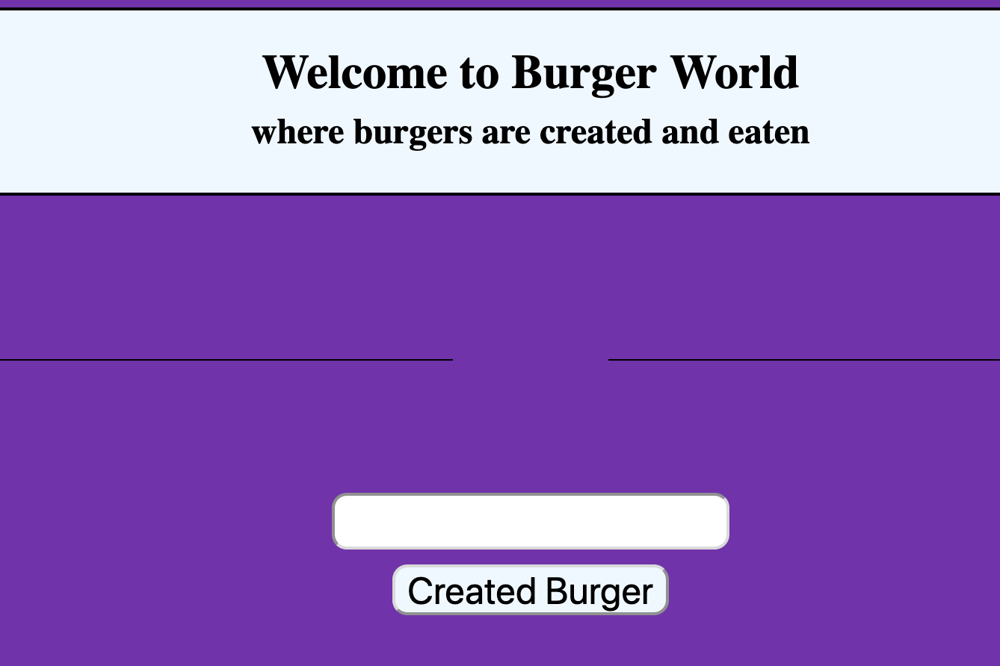

# Eat-da-burger

Simple burger app using mysql table. 

Enter a burger name and click create burger button to create a burger. Then choose devour it to move it to the devoured section of the page. 

## [Try it yourself!](https://glacial-woodland-82955.herokuapp.com/) 



If you wish to look at the code, simply install the repo


HTTPS:
```
$ git clone https://github.com/doctorbebo/Eat-da-burger.git
```


## Built With

* [MySql](https://www.mysql.com/) - MySql Database
* [Node.js](https://nodejs.org/en/) - JavaScript runtime
* [Express](https://expressjs.com/) - Routing
* [Express Handlebars](https://www.npmjs.com/package/express-handlebars) - View Engine
* [HTML](https://developer.mozilla.org/en-US/docs/Web/HTML) - Building Block of the website
* [CSS](https://developer.mozilla.org/en-US/docs/Web/CSS) - Look and feel
* [JavaScript](https://developer.mozilla.org/en-US/docs/Web/Javascript) Front-End Logic